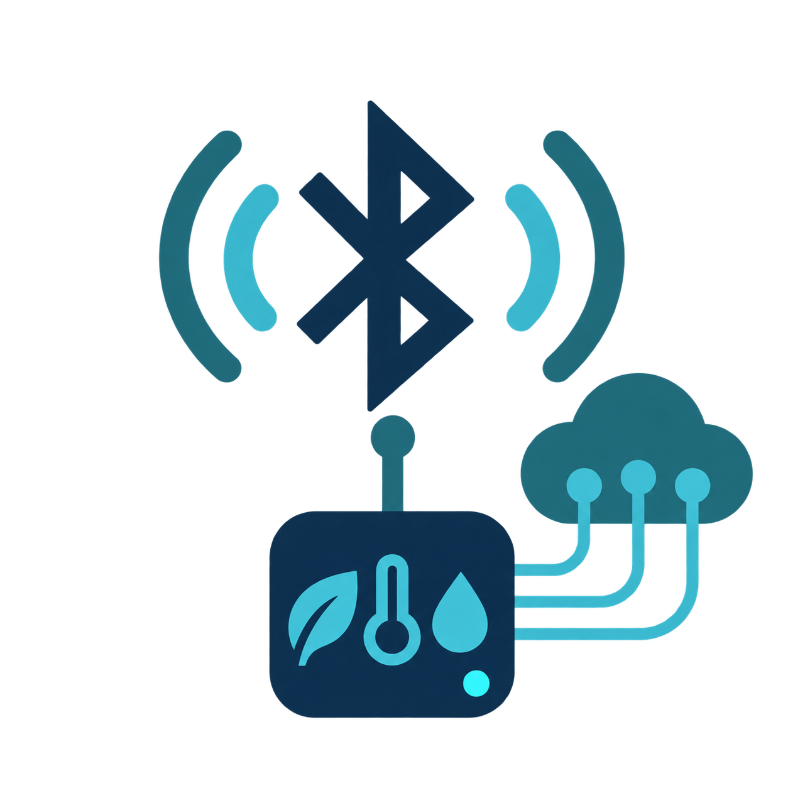

# ble-sensors-mqtt

**English** · [Italiano](README.it.md)



A plugin-based multi-sensor gateway for Raspberry Pi Zero W and newer boards. It collects
Bluetooth LE data and, optionally, Tuya Cloud data, then publishes one normalized snapshot to
MQTT, Prometheus, and SNMP. Intended repository: `desalvo/ble-sensors-mqtt`.

**Version:** 1.0.0 · **Build:** see `BUILD` · **Author:** Alessandro De Salvo
<braket71@gmail.com> · **License:** EUPL-1.2

## Features

- one BLE scanner with continuous polling (30 seconds by default) or a single cycle;
- isolated built-in adapters and third-party plugins loaded through Python entry points;
- SwitchBot in the base install and optional packages for other vendors;
- optional Tuya Cloud provider with credentials read only from protected files;
- aliases for MAC addresses and cloud/multi-channel identifiers;
- MQTT with verified TLS, QoS, retained state, and Last Will;
- optional read-only Prometheus and SNMPv2c exporters with configurable IP addresses and ports;
- `manufacturer`, `model`, and `protocol` in every output, plus all scalar values returned by
  the decoder;
- optional Home Assistant MQTT Discovery with retained configuration and device grouping;
- first-class presence/motion/occupancy/moving semantics across Home Assistant, Prometheus and SNMP;
- optional stale-reading reuse, marking reused snapshots with `stale: true`;
- persistent bounded SQLite MQTT cache (1 GiB by default) for broker outages;
- interactive/non-interactive hardened systemd installer for unattended daemon operation;
- multiarch Docker/Compose and Kubernetes deployment assets for amd64/arm64;
- CI publication of versioned Docker Hub images on release tags and `latest` on `main`;
- tests, linting, Bandit, dependency auditing, and automated release gates;
- transparent PNG application logo, also embedded in the separate English and Italian PDF manuals.

## Sensors and access modes

| Plugin | Brands/protocols | Access | Install profile |
| --- | --- | --- | --- |
| `switchbot` | SwitchBot Meter and recognized models | local BLE advertisements | base |
| `xiaomi` | Xiaomi/Mijia, HHCC, MiBeacon | BLE; bind key for encrypted frames | `.[sensors]` |
| `govee` | Govee | local BLE | `.[sensors]` |
| `inkbird` | Inkbird | BLE; some models need a connection | `.[sensors]` |
| `thermopro` | ThermoPro | local BLE | `.[sensors]` |
| `qingping` | Qingping/ClearGrass | local BLE | `.[sensors]` |
| `bthome` | BTHome, Shelly BLU, ATC/PVVX in BTHome mode | local BLE | `.[sensors]` |
| `ruuvi` | RuuviTag | local BLE | `.[sensors]` |
| `sensorpush` | compatible SensorPush models | local BLE | `.[sensors]` |
| `airthings` | Airthings | active BLE GATT | `.[sensors]` |
| `mopeka` | Mopeka | local BLE | `.[sensors]` |
| `tuya-cloud` | sensors paired with Smart Life/Tuya | cloud API | `.[cloud]`/`.[all]` |

Actual support depends on the model, firmware, encryption, and advertised values. A Tuya
device using BTHome may work locally; proprietary Tuya formats require device-specific local
keys or the cloud. `--list-plugins` reports the adapters available in the current environment.
The vendor app is unnecessary for clear-text BLE advertisements and may coexist with this
gateway. It may be required to pair cloud devices or obtain encryption keys.

## Supported hosts

Linux x86_64/arm64 is supported on Debian-family and Red Hat-family distributions, with either internal Bluetooth or a USB Bluetooth dongle managed by BlueZ. Windows 11+ and macOS Tahoe 26+ are also supported through native Bleak backends; pushes to `main` and release tags build native CI bundles. See [`docs/HOSTS.en.md`](docs/HOSTS.en.md).

On Linux with multiple controllers use `--bluetooth-adapter hci1`; on Windows/macOS the operating system selects the controller.

## Install in a Python virtual environment

Requirements: Raspberry Pi OS Bookworm, Python 3.11+, BlueZ, and a reachable MQTT broker.

```bash
unzip ble-sensors-mqtt-v1.0.0-<BUILD>.zip
cd ble-sensors-mqtt
sudo apt update
sudo apt install -y bluetooth bluez python3 python3-venv
sudo systemctl enable --now bluetooth
python3 -m venv .venv
.venv/bin/pip install --upgrade pip
```

Choose one profile:

```bash
.venv/bin/pip install .             # SwitchBot only; lightest option
.venv/bin/pip install '.[sensors]'  # all BLE decoders
.venv/bin/pip install '.[cloud]'    # SwitchBot and Tuya Cloud
.venv/bin/pip install '.[web]'      # authenticated browser frontend
.venv/bin/pip install '.[all]'      # all BLE/cloud decoders plus web frontend
```

```bash
.venv/bin/ble-sensors-mqtt --version
.venv/bin/ble-sensors-mqtt --list-plugins
.venv/bin/ble-sensors-mqtt --help
```

On a Pi Zero, install only the required plugins and keep the polling interval at 30 seconds
or more.

## Scan and name sensors

Scanning does not require MQTT:

```bash
.venv/bin/ble-sensors-mqtt --scan --scan-duration 15
.venv/bin/ble-sensors-mqtt --scan --plugin switchbot --plugin bthome
```

The JSON output contains recognized devices. Every reading includes `address`, `name`,
`manufacturer`, `model`, `protocol`, `observed_at`, and `data`; unknown identity fields use
`Unknown`.

```bash
# BLE alias
.venv/bin/ble-sensors-mqtt --scan \
  --device-name 'AA:BB:CC:DD:EE:FF=Server Room'

# Cloud or multi-channel alias
.venv/bin/ble-sensors-mqtt --scan --cloud-config ./cloud.toml \
  --sensor-name 'TUYA:bf123456=Basement'
```

The alias replaces `name` in every output; `bluetooth_name` preserves the radio name.
`--device ID` is a repeatable allow-list for published sensors and accepts BLE MAC addresses or cloud/plugin identifiers such as `TUYA:bf123456`.

For encrypted BTHome or Xiaomi/MiBeacon advertisements, export the bind key using the vendor
or firmware tools. Store only its hexadecimal value in a `0600`/`0640` file and reference it
from the TOML file supplied with `--cloud-config`:

```toml
[ble_keys."AA:BB:CC:DD:EE:FF"]
plugin = "bthome" # or "xiaomi"
bindkey_file = "/etc/ble-sensors-mqtt/sensor-aa-bb-bindkey"
```

BTHome requires 16 bytes; Xiaomi accepts 12 or 16 bytes. Never put the key on the command
line or in logs.

## MQTT

### Home Assistant MQTT Discovery

Enable Home Assistant autodiscovery with `--home-assistant-discovery`. The gateway publishes retained configuration topics under `homeassistant/` by default while keeping sensor state on the normal `ble-sensors/.../state` topics. Scalar measurements become Home Assistant `sensor` entities; recognized presence, motion, occupancy, and moving values become proper `binary_sensor` entities with the matching device class. Known measurements receive device/state classes and units, while RSSI, protocol, and stale status are diagnostic entities. All entities from the same physical/cloud sensor are grouped into one Home Assistant device with manufacturer/model metadata. Availability follows the retained bridge status topic.

Presence semantics are recognized from common decoder/vendor keys including BTHome `presence`, `motion`, `occupancy`, and `moving`, plus aliases such as SwitchBot `Detected`, `moveDetected`, and `detectionState`. The original plugin field remains unchanged in MQTT and in the generic exporters.

```bash
.venv/bin/ble-sensors-mqtt --mqtt-host 127.0.0.1 --home-assistant-discovery
```

Use `--home-assistant-discovery-prefix PREFIX` if Home Assistant uses a non-default discovery prefix. Discovery config topics are retained and stale config topics are cleared when sensors/entities disappear or discovery is disabled, provided the runtime state file is preserved.

### Stale readings and MQTT outage cache

With `--reuse-stale-data`, a sensor that is not detected in a polling cycle, or returns an empty `data` object, reuses its last in-memory reading. Reused snapshots preserve the original `observed_at` and add `"stale": true`; fresh snapshots add `"stale": false`. Prometheus exposes `ble_sensors_stale` and sets `ble_sensors_up=0` for reused data.

The MQTT disk cache is enabled by default. If the broker is unavailable at startup or disconnects later, polling continues and MQTT messages are appended transactionally to SQLite. The default maximum logical size is 1 GiB; when full, the oldest queued messages are discarded to make room for the newest data. After reconnection, queued messages are sent FIFO and removed only after publish acknowledgement. Use `--mqtt-cache-path`, `--mqtt-cache-max-size`, or `--no-mqtt-cache` to customize it. When `--state-file` is set, the default cache file is `mqtt-cache.sqlite3` in the same directory.


```bash
# One-cycle test
.venv/bin/ble-sensors-mqtt --mqtt-host 127.0.0.1 --once

# Continuous service, every 60 seconds
.venv/bin/ble-sensors-mqtt --mqtt-host 192.0.2.10 --poll-interval 60 --allow-insecure-mqtt

# Production with TLS
.venv/bin/ble-sensors-mqtt --mqtt-host mqtt.example.net --mqtt-port 8883 \
  --mqtt-username sensor-publisher \
  --mqtt-password-file /etc/ble-sensors-mqtt/mqtt-password \
  --mqtt-tls --mqtt-ca-file /etc/ssl/certs/ca-certificates.crt
```

For `AA:BB:CC:DD:EE:FF`, the topic is `ble-sensors/aabbccddeeff/state`; bridge status is
`ble-sensors/bridge/status`. Example payload:

```json
{
  "address": "AA:BB:CC:DD:EE:FF",
  "name": "Server Room",
  "bluetooth_name": "Meter Plus",
  "manufacturer": "SwitchBot",
  "model": "Meter Plus",
  "protocol": "SwitchBot BLE",
  "rssi": -58,
  "observed_at": "2026-09-11T20:00:00+00:00",
  "data": {"temperature": 23.4, "humidity": 51, "battery": 92}
}
```

`data` contains every value returned by the decoder, including booleans, versions, units,
and events. Secret files must have permissions `0640` or more restrictive.

## Tuya Cloud

Run `.venv/bin/ble-sensors-mqtt --cloud-help`. In the Tuya IoT portal, create a Smart Home
project, link the Smart Life/Tuya account, authorize device APIs, and record the region,
Access ID, Access Secret, and one Device ID. Store the two secrets in separate `0640` files.

```toml
[cloud.tuya]
enabled = true
region = "eu"
api_key_file = "/etc/ble-sensors-mqtt/tuya-api-key"
api_secret_file = "/etc/ble-sensors-mqtt/tuya-api-secret"
api_device_id = "REFERENCE_DEVICE_ID"
device_ids = ["DEVICE_ID_TO_EXPORT"] # optional; empty means all
```

```bash
sudo install -m 0640 -o root -g ble-sensors-mqtt config/cloud.example.toml \
  /etc/ble-sensors-mqtt/cloud.toml
.venv/bin/ble-sensors-mqtt --scan --cloud-config /etc/ble-sensors-mqtt/cloud.toml
```

A cloud failure is isolated and does not discard BLE readings from the cycle. Calls use
HTTPS; review the service privacy notice, data location, and terms.

## Prometheus

```bash
.venv/bin/ble-sensors-mqtt --mqtt-host 192.0.2.10 --prometheus
curl http://127.0.0.1:9105/metrics
```

The exporter exposes the following metric families:

| Metric | Type | Main labels / meaning |
| --- | --- | --- |
| `ble_sensors_up` | gauge | sensor identity labels; `1` fresh, `0` stale/reused |
| `ble_sensors_stale` | gauge | sensor identity labels; inverse freshness indicator |
| `ble_sensors_temperature_celsius` | gauge | recursively discovered `temperature` |
| `ble_sensors_humidity_percent` | gauge | recursively discovered `humidity` |
| `ble_sensors_battery_percent` | gauge | `battery` or `battery_percent` |
| `ble_sensors_rssi_dbm` | gauge | top-level RSSI in dBm |
| `ble_sensors_presence` | gauge | recognized human/person presence, `1` present and `0` absent |
| `ble_sensors_motion` | gauge | recognized motion state, `1` detected and `0` clear |
| `ble_sensors_occupancy` | gauge | recognized occupancy state, `1` occupied and `0` unoccupied |
| `ble_sensors_moving` | gauge | recognized moving state, `1` moving and `0` stationary |
| `ble_sensors_sensor_value` | gauge | identity + `key,unit`; all numeric/boolean `data` scalars |
| `ble_sensors_sensor_info` | gauge | identity + `key,unit,value`; all string `data` scalars, sample value `1` |
| `ble_sensors_devices` | gauge | current exported snapshot count |
| `ble_sensors_cycles_total` | counter | polling cycles attempted |
| `ble_sensors_cycles_failed_total` | counter | failed polling cycles |

Sensor identity labels are `address`, `name`, `manufacturer`, `model`, and `protocol`. Generic keys are
flattened dotted paths from `data`; booleans become `0`/`1`, `null` is omitted, and up to 256 scalar values
per sensor are exported. The reserved `data.units` map supplies the `unit` label and is not itself exported.
See `docs/USAGE.en.md` for the complete metric contract and examples.

The default is `127.0.0.1:9105`; use `::` for IPv6. `/healthz` reports liveness and `/readyz` reports
readiness. A non-loopback bind requires `--allow-external-prometheus`; the endpoint has no built-in TLS or
authentication.

## SNMP

```bash
sudo sh -c 'umask 077; printf %s "RANDOM_COMMUNITY" > /etc/ble-sensors-mqtt/snmp-community'
sudo chown root:ble-sensors-mqtt /etc/ble-sensors-mqtt/snmp-community
sudo chmod 0640 /etc/ble-sensors-mqtt/snmp-community
.venv/bin/ble-sensors-mqtt --mqtt-host 192.0.2.10 --snmp \
  --snmp-community-file /etc/ble-sensors-mqtt/snmp-community
snmpwalk -v2c -c RANDOM_COMMUNITY 127.0.0.1:1161 1.3.6.1.4.1.32473.1.1
```

At the default base OID, `.1.0` identifies the application, `.2.0` reports the exported device count,
`.10.1` is the common device table (identity, RSSI, temperature, humidity, battery, timestamp, stale,
presence, motion, occupancy and moving), and `.20.1` is the generic scalar table (`key`, text-rendered value, type, unit, device index and
scalar index). The generic table contains up to 256 `data` scalars per sensor. Device indexes are transient.
The exact OID/type contract is documented in `docs/BLE-SENSORS-MQTT-MIB.txt` and `docs/USAGE.en.md`.

The default listener is `127.0.0.1:1161/udp`; non-loopback binding requires `--allow-external-snmp`.
SNMPv2c is clear text. PEN 32473 is documentation-only; use an assigned `--snmp-base-oid` in production.

## systemd

Easy end-to-end installation from a GitHub clone, including host prerequisites, Bluetooth validation, venv, and service:

```bash
git clone https://github.com/desalvo/ble-sensors-mqtt.git
cd ble-sensors-mqtt
sudo scripts/install-from-github.sh --mqtt-host mqtt.example.net --prometheus
```

Interactive and unattended systemd installation are also supported. CLI values remain prompt defaults.

```bash
sudo scripts/install-systemd.sh --mqtt-host mqtt.example.net
sudo scripts/install-systemd.sh --non-interactive --mqtt-host mqtt.example.net --mqtt-tls --prometheus
```

See `docs/SYSTEMD.en.md`.

## Docker and Kubernetes

Multiarch `linux/amd64,linux/arm64` Docker/Compose and Kubernetes manifests are included. Before BLE use in a container/pod, run `sudo scripts/check-bluetooth-host.sh --strict`; Docker and Kubernetes use host BlueZ through `/run/dbus` without requiring `privileged`.

```bash
docker login
scripts/build-docker.sh
cd docker && cp .env.example .env && cp arguments.example arguments && docker compose up -d
kubectl apply -k kubernetes/
```

See `docs/DOCKER.en.md` and `docs/KUBERNETES.en.md`. MQTT is outbound; Prometheus is TCP/9105 and SNMP is UDP/1161. External exposure is opt-in.

## CLI reference

| Option | Default | Purpose |
| --- | ---: | --- |
| `--config FILE` | native path | Persistent TOML configuration; explicit CLI options override it |
| `--scan` | off | Print recognized sensors and exit |
| `--list-plugins` | off | Show plugin and dependency status |
| `--plugin NAME` | all installed | Restrict plugins; repeatable |
| `--cloud-help` | off | Show Tuya setup instructions |
| `--cloud-config FILE` | none | Protected TOML configuration |
| `--scan-duration S` | 8 | BLE scan duration |
| `--bluetooth-adapter ADAPTER` | OS default | Linux BlueZ controller (e.g. `hci1`) |
| `--poll-interval S` | 30 | Poll interval, 1–86400 seconds |
| `--plugin-timeout S` | 15 | Maximum decoder/cloud call duration |
| `--device ID` | all | Repeatable sensor allow-list (BLE MAC or cloud/plugin ID) |
| `--device-name MAC=NAME` | radio name | Repeatable BLE alias |
| `--sensor-name ID=NAME` | original | Cloud/multi-channel alias |
| `--mqtt-host HOST` | none | MQTT broker |
| `--home-assistant-discovery` | off | Publish Home Assistant MQTT Discovery config |
| `--home-assistant-discovery-prefix` | `homeassistant` | Home Assistant discovery prefix |
| `--mqtt-port PORT` | 1883/8883 | Broker port |
| `--mqtt-topic-prefix` | `ble-sensors` | Topic root |
| `--mqtt-username` | none | Broker username |
| `--mqtt-password-file` | none | Password in a protected file |
| `--mqtt-tls` | off | TLS with certificate verification |
| `--mqtt-connect-timeout S` | 15 | CONNACK/publish acknowledgement timeout |
| `--mqtt-cache` / `--no-mqtt-cache` | enabled | Persist unsent MQTT messages on disk |
| `--mqtt-cache-path FILE` | beside state file/user state dir | SQLite spool path |
| `--mqtt-cache-max-size SIZE` | `1GiB` | Bounded logical spool size; accepts bytes/KiB/MiB/GiB/TiB |
| `--reuse-stale-data` | off | Reuse previous sensor data with `stale: true` when a sensor is missing or empty |
| `--allow-insecure-mqtt` | off | Explicit plaintext MQTT risk override |
| `--qos` | 1 | QoS 0, 1, or 2 |
| `--retain` / `--no-retain` | retain | Retained sensor state |
| `--stale-cycles N` | 3 | Missing cycles before clearing retained state |
| `--state-file FILE` | none | Persist retained-topic cleanup state across restarts |
| `--once` | off | Run one cycle |
| `--prometheus` | off | Enable HTTP metrics |
| `--prometheus-host` | `127.0.0.1` | Listen IP |
| `--prometheus-port` | 9105 | TCP port |
| `--allow-external-prometheus` | off | Explicitly allow non-loopback unauthenticated HTTP |
| `--snmp` | off | Enable read-only SNMPv2c |
| `--snmp-host` | `127.0.0.1` | Listen IP |
| `--snmp-port` | 1161 | UDP port |
| `--snmp-community-file` | none | Community in a protected file |
| `--snmp-base-oid` | `.1.3.6.1.4.1.32473.1.1` | Export subtree |
| `--allow-external-snmp` | off | Explicitly allow non-loopback plaintext SNMPv2c |

## Third-party plugins

Implement `SensorPlugin` from `ble_sensors_mqtt.plugin_api` and register a no-argument
factory:

```toml
[project.entry-points."ble_sensors_mqtt.sensor_plugins"]
acme = "acme_sensor.plugin:AcmePlugin"
```

`decode(device, advertisement)` returns zero or more `SensorReading` objects. Always provide
manufacturer, model, and protocol, and never put secrets in sensor data. Plugin errors are
isolated.

Cloud providers use a separate entry-point group and receive their own TOML configuration plus
the protected-file secret reader:

```toml
[project.entry-points."ble_sensors_mqtt.cloud_plugins"]
acme-cloud = "acme_sensor.cloud:AcmeCloudPlugin"
```

The cloud class/factory is constructed as `AcmeCloudPlugin(config, read_secret)` and implements
`CloudPlugin.poll()`. By default `acme-cloud` reads `[cloud.acme]`; a class may expose
`config_key` to select a different table. Cloud failures are isolated from BLE and from other
cloud providers.


## Optional authenticated web frontend

Install `.[web]` (or `.[all]`) and enable `--frontend` for a professional responsive browser console. It shows the live/stale status and normalized values of every exported sensor, supports admin/reader roles, persistent runtime configuration, local users, LDAP, generic OIDC SSO, portable TOTP MFA for local/LDAP users, and encrypted full backup/restore including configuration, user/MFA state and MQTT cache. The bootstrap account is `admin` / `password` and must change its password at first login. Browser-persisted settings are stored in a writable runtime override so protected `/etc`/Kubernetes configuration can remain read-only. See `docs/FRONTEND.en.md`.

## Security, AgID alignment, and limitations

The project applies least privilege, verified TLS, secrets outside command lines and
environment variables, bounded inputs, safe JSON conversion, optional dependencies,
credential-free logging, hardened systemd settings, and automated checks. See
[`docs/AGID-SECURITY.en.md`](docs/AGID-SECURITY.en.md) and [`SECURITY.en.md`](SECURITY.en.md). This is a
technical self-assessment against AgID secure-software good practices, not an AgID
certification. Before production, perform threat modeling and hardware testing, prepare
vulnerability handling and rollback, and configure firewall and MQTT ACLs. BLE advertisements
and SNMPv2c do not provide end-to-end authenticity or confidentiality.

## Documentation, build, and license

- English manual: [`docs/USAGE.en.md`](docs/USAGE.en.md) and `docs/ble-sensors-mqtt-manual-v1.0.0-en.pdf`
- Manuale italiano: [`docs/USAGE.it.md`](docs/USAGE.it.md) and `docs/ble-sensors-mqtt-manual-v1.0.0-it.pdf`

`scripts/build-package.sh` updates `BUILD` in UTC as `YYYYMMDD-HHMM`, then creates ZIP,
TAR.GZ, and SHA-256 checksums. Licensed under EUPL-1.2; see `LICENSE`.

## Production release policy

Release 1.0.0 is designed to fail closed on unsafe network exposure. Remote or credentialed plaintext MQTT requires the explicit `--allow-insecure-mqtt` override; production deployments should use verified TLS. Prometheus/health and SNMPv2c stay loopback-only unless their explicit external-access flags are supplied. Cloud and decoder calls are bounded by `--plugin-timeout`; MQTT messages are bounded and QoS publications are acknowledged before a cycle is considered successful.

The Prometheus HTTP server exposes `/metrics`, `/healthz`, and `/readyz`. Readiness becomes false before the first successful cycle and when the latest success is older than approximately three polling intervals. MQTT retained sensor topics are removed after `--stale-cycles` consecutive misses (default 3), not after one transient BLE miss. With systemd, `--state-file /var/lib/ble-sensors-mqtt/state.json` preserves this cleanup state across process restarts.

A production release must pass `scripts/release-check.sh`. The gate runs compilation, Ruff, pytest with coverage, Bandit, `pip-audit`, both PDF manual builds, standard wheel/sdist creation, `twine check`, CycloneDX SBOM generation, and release-content verification. CI executes the runtime suite on Python 3.11, 3.12, and 3.13 with all optional sensor/cloud dependencies. See `docs/PRODUCTION.en.md`.

GitHub Actions also automates publication. A pushed tag such as `v1.0.0` triggers the complete test/build pipeline; only after every gate succeeds does the `release` job verify that the tag matches both `VERSION` and `pyproject.toml`, download the CI-built artifacts, and create or update the corresponding GitHub Release. The release contains wheel, sdist, SBOM, deterministic project archives, SHA-256 checksums, and the separate EN/IT manuals. No personal GitHub token is required: the job uses the repository-scoped `GITHUB_TOKEN` with `contents: write` only for the release job.

### Installer component selection and release checks

The interactive Linux installer starts by asking which optional dependency groups to install: additional BLE sensor decoders (`sensors`), cloud providers (`cloud`), and the authenticated web frontend (`web`). For unattended installs use the corresponding `--with-*`/`--without-*` switches. Windows/macOS graphical installers expose OS components (runtime, background service/agent, Settings GUI); runtime integrations are then enabled from Settings/configuration.

`scripts/release-check.sh` bootstraps `.[all,dev,release]` by default so tools such as Ruff and ReportLab are present even for a manual release check. Set `BLE_SENSORS_RELEASE_SKIP_BOOTSTRAP=1` only in a pre-provisioned/offline environment.
